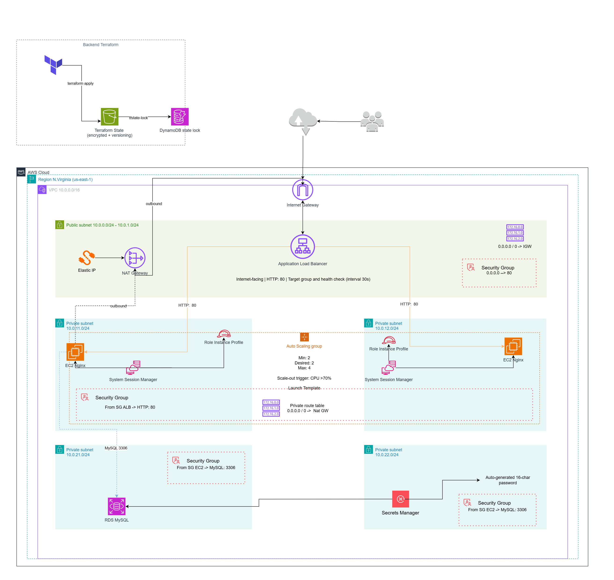

# AWS Three-Tier Architecture — Laboratorio Terraform

## ¿Qué hace este proyecto?

Despliega una arquitectura de tres capas en AWS completamente automatizada con Terraform. La infraestructura expone un servidor web Nginx a través de un Application Load Balancer, escala automáticamente según la carga de CPU, y persiste datos en una base de datos MySQL gestionada por RDS, todo dentro de una VPC privada con segmentación de red por capas.

---

## Diagrama de Arquitectura

---

## Recursos Desplegados

### Red (módulo `network`)

| Recurso                 | Nombre                               | Descripción                           |
| ----------------------- | ------------------------------------ | ------------------------------------- |
| VPC                     | `{project}-vpc`                      | Red principal, DNS habilitado         |
| Subnet pública x2       | `{project}-public-alb-subnet-1/2`    | Para ALB, en 2 AZs                    |
| Subnet privada web x2   | `{project}-private-web-subnet-11/12` | Para instancias EC2                   |
| Subnet privada DB x2    | `{project}-private-db-subnet-21/22`  | Para RDS                              |
| Internet Gateway        | `{project}-igw`                      | Salida a internet para capa pública   |
| NAT Gateway             | `{project}-nat-gw`                   | Salida a internet para capas privadas |
| Elastic IP              | `{project}-nat-eip`                  | IP fija para el NAT Gateway           |
| Route Table pública     | `{project}-public-route-table`       | Ruta 0.0.0.0/0 → IGW                  |
| Route Table web privada | `{project}-private-route-table`      | Ruta 0.0.0.0/0 → NAT                  |
| Route Table DB privada  | `{project}-private-db-route-table`   | Sin salida a internet                 |

### Cómputo (módulo `compute`)

| Recurso                   | Nombre                          | Descripción                         |
| ------------------------- | ------------------------------- | ----------------------------------- |
| Security Group ALB        | `{project}-web-sg`              | Permite HTTP 80 desde internet      |
| Security Group EC2        | `{project}-ec2-sg`              | Permite HTTP 80 solo desde ALB SG   |
| IAM Role                  | `{project}-ec2-ssm-role`        | Permite acceso SSM a las instancias |
| IAM Instance Profile      | `{project}-ec2-ssm-profile`     | Asocia el rol a las instancias      |
| Launch Template           | `{project}-web-launch-template` | AMI Amazon Linux 2023 + Nginx       |
| Application Load Balancer | `{project}-web-lb`              | Público, multi-AZ                   |
| Target Group              | `{project}-web-tg`              | Health check en `/`                 |
| ALB Listener              | —                               | Puerto 80 → Target Group            |
| Auto Scaling Group        | `{project}-web-asg`             | min=2, max=4, desired=2             |
| ASG Scaling Policy        | `{project}-cpu-web-asg-scale`   | Target Tracking CPU al 70%          |

### Base de Datos (módulo `database`)

| Recurso                | Nombre                       | Descripción                          |
| ---------------------- | ---------------------------- | ------------------------------------ |
| DB Subnet Group        | `{project}-rds-subnet-group` | Subnets privadas DB                  |
| Security Group RDS     | `{project}-db-sg`            | Permite MySQL 3306 solo desde EC2 SG |
| RDS MySQL              | `{project}-rds`              | MySQL 8.0, db.t3.micro, 20GB gp2     |
| Secrets Manager Secret | `{project}-db-password-*`    | Contraseña aleatoria de 16 chars     |

### Backend Terraform (`backend-infra`)

| Recurso        | Nombre                       | Descripción                          |
| -------------- | ---------------------------- | ------------------------------------ |
| S3 Bucket      | `{project}-tfstate-{suffix}` | Estado remoto cifrado con versionado |
| DynamoDB Table | `{project}-tfstate-lock`     | Bloqueo de estado concurrente        |

---

## `backend-infra`

La carpeta `backend-infra` resuelve un problema de huevo y gallina: Terraform necesita un lugar donde guardar su estado (`terraform.tfstate`), pero ese lugar también debe ser creado con infraestructura. Si guardas el estado localmente, cualquier otro miembro del equipo o pipeline de CI/CD trabajará con un estado diferente, lo que genera conflictos y recursos duplicados o destruidos por error.

Esta carpeta contiene los scripts (`setup-backend.ps1` / `setup-backend.sh`) y la configuración Terraform (`backend_init.tf`) para crear **antes que nada**:

- Un **bucket S3** con versionado habilitado y acceso público bloqueado, donde se almacena el `tfstate` cifrado.
- Una **tabla DynamoDB** que actúa como mutex: cuando alguien ejecuta `terraform apply`, adquiere un lock en esa tabla. Si otro proceso intenta ejecutar al mismo tiempo, Terraform lo rechaza hasta que el lock se libere.

Sin esto, en un equipo o en un pipeline automatizado, dos ejecuciones simultáneas podrían corromper el estado y dejar la infraestructura en un estado inconsistente.

---

## Base de Datos Relacional ¿Por qué RDS y no una base de datos NoSQL?

Una base de datos relacional como **RDS MySQL** es la elección correcta cuando los datos tienen estructura fija y relaciones entre entidades (usuarios, pedidos, productos, etc.), y cuando se necesita consistencia transaccional (ACID). En una arquitectura de tres capas clásica, la capa de datos suele manejar exactamente ese tipo de información.

Una base NoSQL como DynamoDB es ideal para casos de uso diferentes: acceso por clave primaria a altísima escala, datos sin esquema fijo, o patrones de lectura/escritura muy predecibles. Forzar ese modelo en una aplicación relacional complica las consultas, elimina los joins y puede generar inconsistencias de datos.

En resumen: **RDS cuando los datos tienen relaciones y necesitas consistencia; NoSQL cuando necesitas escala masiva y flexibilidad de esquema**.

---

## ¿Por qué usar Secrets Manager?

La contraseña de la base de datos se genera aleatoriamente con 16 caracteres y se almacena en **AWS Secrets Manager** en lugar de hardcodearla en el código o pasarla como variable de entorno.

Las razones son concretas:

1. **Nunca aparece en texto plano** en el código fuente, en el `tfstate`, ni en logs de CI/CD.
2. **Rotación automática**: Secrets Manager puede rotar la contraseña periódicamente sin tocar el código de la aplicación.
3. **Acceso con IAM**: las instancias EC2 solo pueden leer el secreto si tienen el permiso IAM explícito. Si una instancia es comprometida, el atacante no tiene la contraseña embebida en el binario.
4. **Auditoría**: cada acceso al secreto queda registrado en CloudTrail.

La alternativa (pasar la contraseña como variable de Terraform o variable de entorno) la expone en el estado de Terraform, en los logs del pipeline y en la memoria del proceso, lo cual es un riesgo de seguridad inaceptable en producción.

---

## Seguridad:

### ✅ Buenas prácticas cubiertas

| Práctica                                         | Implementación                                                                                                     |
| ------------------------------------------------ | ------------------------------------------------------------------------------------------------------------------ |
| **Segmentación de red en 3 capas**               | Subnets públicas solo para ALB; EC2 y RDS en subnets privadas sin IP pública                                       |
| **Security Groups con mínimo privilegio**        | ALB solo acepta 80 desde internet; EC2 solo acepta 80 desde el SG del ALB; RDS solo acepta 3306 desde el SG de EC2 |
| **RDS no accesible públicamente**                | `publicly_accessible = false`                                                                                      |
| **Sin acceso SSH directo**                       | Las instancias no tienen key pair; el acceso se hace por SSM Session Manager                                       |
| **IAM Role con mínimo privilegio**               | Solo se adjunta `AmazonSSMManagedInstanceCore`, sin permisos adicionales                                           |
| **Credenciales en Secrets Manager**              | La contraseña de RDS nunca aparece en texto plano en el código                                                     |
| **Contraseña aleatoria y robusta**               | 16 caracteres con caracteres especiales, generada por `random_password`                                            |
| **Estado de Terraform cifrado y con lock**       | S3 con `encrypt = true`, DynamoDB para bloqueo concurrente                                                         |
| **Versionado del estado**                        | S3 con versionado habilitado, permite rollback del estado                                                          |
| **Acceso público bloqueado al bucket de estado** | `block_public_acls`, `block_public_policy`, etc.                                                                   |
| **Alta disponibilidad**                          | ALB, ASG y RDS subnet group en 2 Availability Zones                                                                |
| **Protección contra borrado accidental en prod** | `enable_deletion_protection` en el ALB cuando `environment == "prod"`                                              |
| **Instancias EC2 sin IP pública**                | `associate_public_ip_address = false` en el Launch Template                                                        |
| **AMI siempre actualizada**                      | Data source busca la última Amazon Linux 2023 en cada despliegue                                                   |

---

### ❌ Prácticas que faltaron y por qué no se cubrieron en este laboratorio

| Práctica faltante                                      | Por qué no se cubrió                                                                                                                                                                                               | Impacto en producción                                                                                                                                            |
| ------------------------------------------------------ | ------------------------------------------------------------------------------------------------------------------------------------------------------------------------------------------------------------------ | ---------------------------------------------------------------------------------------------------------------------------------------------------------------- |
| **HTTPS en el ALB (TLS/SSL)**                          | Requiere un dominio registrado y un certificado ACM. En un lab sin dominio propio, configurar HTTPS añade fricción sin aportar al aprendizaje de la arquitectura.                                                  | En producción es obligatorio. Todo tráfico HTTP debe redirigirse a HTTPS (listener 443 + certificado ACM).                                                       |
| **RDS Multi-AZ**                                       | `multi_az = true` duplica el costo. En un lab de corta duración no es justificable económicamente.                                                                                                                 | En producción es el estándar para cualquier base de datos crítica. Garantiza failover automático en menos de 2 minutos.                                          |
| **Cifrado en reposo para RDS**                         | `storage_encrypted = true` requiere una KMS key, lo que añade costo y complejidad de gestión de claves.                                                                                                            | En producción es obligatorio por regulaciones como PCI-DSS, HIPAA y GDPR.                                                                                        |
| **VPC Flow Logs**                                      | Generan costos de CloudWatch Logs continuos. En un lab temporal no aportan valor práctico.                                                                                                                         | En producción son esenciales para auditoría, detección de anomalías y respuesta a incidentes.                                                                    |
| **WAF en el ALB**                                      | AWS WAF tiene costo fijo mensual por WebACL. Excede el presupuesto de un laboratorio.                                                                                                                              | En producción protege contra OWASP Top 10, bots y ataques DDoS a nivel de aplicación.                                                                            |
| **Rotation automática del secreto en Secrets Manager** | Requiere una Lambda de rotación y permisos adicionales. Añade complejidad que distrae del objetivo del lab.                                                                                                        | En producción la rotación automática cada 30-90 días es una práctica estándar de seguridad.                                                                      |
| **Permisos IAM para leer el secreto desde EC2**        | El rol de EC2 tiene solo permisos SSM. Para que la app lea el secreto necesitaría un permiso `secretsmanager:GetSecretValue` explícito. No se implementó porque no hay una aplicación real consumiendo el secreto. | En producción el rol debe tener el permiso mínimo necesario para leer solo su secreto específico por ARN.                                                        |
| **Backup automatizado de RDS**                         | `backup_retention_period` está en su valor por defecto (0 en algunos casos).                                                                                                                                       | En producción se recomienda mínimo 7 días de retención de backups automáticos.                                                                                   |
| **CloudTrail habilitado**                              | Es un servicio a nivel de cuenta, no de stack de Terraform. En un lab se asume que ya existe o no se configura.                                                                                                    | En producción es el registro de auditoría de todas las llamadas a la API de AWS. Obligatorio en entornos regulados.                                              |
| **Restricción de egress en Security Groups**           | Los SGs de ALB y EC2 tienen egress `0.0.0.0/0` abierto.                                                                                                                                                            | En producción el egress también debe restringirse al mínimo necesario (por ejemplo, EC2 solo debería salir al puerto 3306 de la subnet de DB y al 443 para SSM). |
